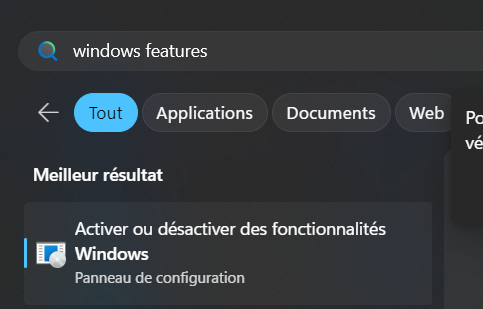
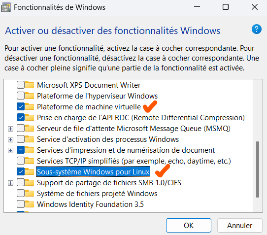
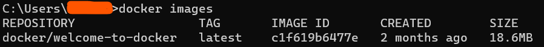
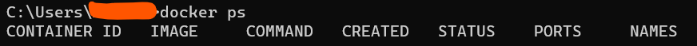
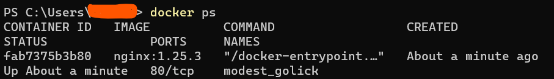
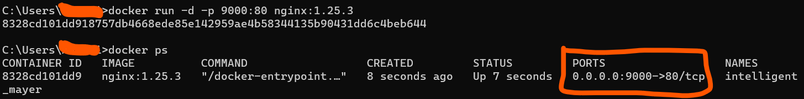
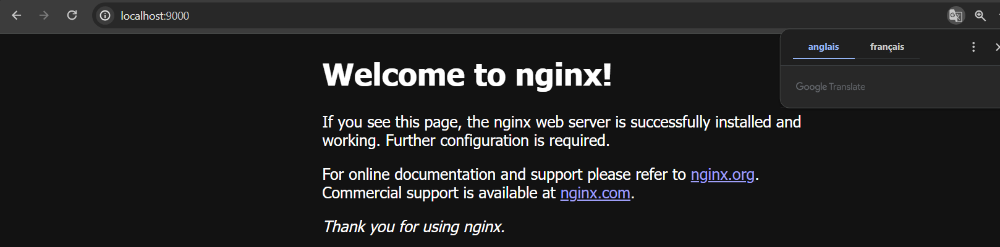

# Installation followed in my case

## 1. Install WSL and Ubuntu distribution (default Linux distribution)

### 1.1. What is a distribution

A Linux distribution is a complete set of programs and software based on the Linux operating system. Think of a cake: Linux is like the basic cake recipe. A Linux distribution is like a specific cake with particular ingredients and flavors.

Imagine you want to bake a chocolate cake. You can choose different recipes for this cake: one with more chocolate, one with nuts or chocolate chips, or even one with a special icing. Each recipe is a different cast, with unique features and functions.

Similarly, a Linux distribution is a specific version of Linux that has been customized by a team of developers. They add specific programs, applications and features to make Linux easier to use and meet users' needs.

### 1.2. Installation

* Open PowerShell with admin privileges
* Check "wsl --status": nothing appeared
* Execute "wsl --install"
* Restart the computer
* The ubuntu distro will open (or open it yourself), then create user account (username and password)

More info here: https://learn.microsoft.com/fr-fr/windows/wsl/setup/environment#set-up-your-linux-user-info

Note: You need to set up a Linux user account every time you add, reinstall or reset a distribution.
This user is the admin

* Execute "sudo apt update && sudo apt upgrade"

* Check that you have Windows Home (version of your Windows)

> Press Windows + R to open the Run dialog box.

> Type "winver" (without quotation marks) in the Run dialog box, then press Enter or click OK.

> A window entitled "About Windows" will open, displaying information about the version of Windows installed on your system.

> Look for the line indicating the Windows version, which may look something like this: "Windows 11 Pro", "Windows 11 Enterprise", "Windows 11 Home" or "Windows 11 Education".

Note: Windows Familly = Windows Home

* Check that Second Level Address Translation (SLAT) is supported by Windows.

For that, open PowerShell and execute: "systeminfo.exe" and at the bottom, ensure that Hyper-V is activated. Otherwise, follow this:

https://docs.docker.com/desktop/troubleshoot/topics/#virtualization

* Enable hardware virtualization in BIOS

https://docs.docker.com/desktop/troubleshoot/topics/#virtualization (same link as previous)

Your machine must have the following features for Docker Desktop to function correctly:

**WSL 2 and Windows Home**
Virtual Machine Platform

Windows Subsystem for Linux
Virtualization enabled in the BIOS
Hypervisor enabled at Windows startup

* Install Docker Desktop on Windows

https://docs.docker.com/desktop/install/windows-install/#install-docker-desktop-on-windows

> Download the installer using the download button at the top of the page, or from the release notes.

> Double-click Docker Desktop Installer.exe to run the installer. By default, Docker Desktop is installed at C:\Program Files\Docker\Docker.

> Follow the instruction. Once finished, restart the PC

> Sign up (docker account) using gmail or github (I used github): create a username > sign in > go back to Docker Desktop > and that's all.

> In VS Code, download the WSL extension (WSL). You will get a "remote explorer" icon.

Note that Docker CLI is also locally installed. So, if you open your CMD (on windows), your can use the "docker" command and execute some docker commands.

Example:
* List the currently available images: docker images.

* List running containers: docker ps

Here, no containiner is currently running.

### 1.3. More resources: WSL with VSCode, Git, Docker, ...

https://learn.microsoft.com/en-us/windows/wsl/tutorials/wsl-vscode

# About Containers and images

## 2. Containers and Images
### 2.1. Difference between containers and images

**A un enfant de 8 ans:**
Imagine que tu veuilles avoir une maison spéciale pour tes jouets. Une image Docker est comme un plan pour construire cette maison. Elle contient toutes les instructions nécessaires pour construire ta maison de jouets de la même manière à chaque fois.

Maintenant, un conteneur Docker est comme la maison elle-même. Une fois que tu as le plan (l'image Docker), tu peux construire autant de maisons que tu veux (les conteneurs Docker). Chaque conteneur est une copie exacte de la maison spécifiée par le plan (l'image), mais ils sont tous indépendants les uns des autres. Tu peux jouer avec différents jouets dans chaque maison sans qu'ils n'interfèrent les uns avec les autres.

En résumé, l'image Docker est le plan pour construire une maison spécifique, tandis que le conteneur Docker est la maison elle-même, basée sur ce plan.

**En termes techniques:**
Une image Docker est un fichier qui contient tous les éléments nécessaires pour exécuter un logiciel, tels que les fichiers, les bibliothèques et les configurations. C'est une sorte de modèle de référence.

Un conteneur Docker est une instance en cours d'exécution de cette image. Il s'agit d'un environnement isolé où le logiciel peut s'exécuter de manière indépendante, sans affecter les autres conteneurs ou le système hôte. Chaque conteneur a sa propre copie des fichiers et des bibliothèques nécessaires pour exécuter le logiciel.

En résumé, une image Docker est un modèle qui contient tout ce dont un logiciel a besoin pour fonctionner, et un conteneur Docker est une instance en cours d'exécution de ce modèle, isolée et indépendante des autres conteneurs.

### 2.2. Use existing docker images: Docker Hub

* In google, type docker hub and pick the first link or click on this: https://hub.docker.com/

* In the search bar, type for any service you are looking for. For example, redis or mongodb, nginx ...
(redis is a NoSQL DBS as mongodb is). This will list you the available redis images.

* Click on the image (docker official) for example: the page explains how to use it, list of tags, and many other stuffs

Note: there are image versionning. Thus, images are versioned (versions are identified by tags: image tags). So, you can run a container for each version.
We will use in this example, nginx image (web server).

* Pick a specific image tag. Let's ta the version 1.25.3 (lastes currently)

* Go to your terminal and execute: docker pull nginx:1.25.3
This will download it locally

* Examine the vulnerabilities and recommandations
docker scout quickview nginx:1.25.3

* List the available images: docker images
Now, we will see the downloaded image.

* To run an image in a container using the CLI, type: 
docker run nginx:1.25.3

* Open a new terminal session [powershell or cmd] (to not shut down the containg which is currently running), an list containers that are running

docker ps

"modest_golick" is a random name generated by docker if you do not specify one.

* To shut down the container (exit): CTRL + C

* To start a container without blocking the terminal:
docker run -d nginx:1.25.3 (it runs the container in background)

* To see the logs of execution, use
docker logs container_short_id

* To exit: CRTL + C

* To run an image (stored on a server or the docker hub) without download it locally, use:
docker run -d nginx:1.25.3 (you can remove -d also)
First it will pull from docker hub (by default) and then run it.

### 2.3. Port binding: How to access to your container from another device, client, or whatever you want

Our nginx container run on port 80. If we try to access to the nginx app in our browser (localhost:80), there will be an error (no page). To access the nginx container, make a port binding.

#### 2.3.1. What is a port binding?

Dans Docker, le port binding (ou liaison de port) permet de faire correspondre les ports d'un conteneur Docker avec les ports du système hôte sur lequel il s'exécute.

Lorsqu'un conteneur Docker est lancé, il peut écouter des connexions réseau sur des ports spécifiques à l'intérieur du conteneur. Par défaut, ces ports ne sont pas accessibles directement depuis le système hôte.

Le port binding permet de rediriger le trafic réseau entrant sur un port spécifique du système hôte vers un port spécifique du conteneur Docker. Cela permet aux applications ou aux services s'exécutant dans le conteneur d'être accessibles depuis le système hôte ou depuis d'autres machines du réseau.

Par exemple, si un conteneur Docker exécute un serveur Web qui écoute les connexions sur le port 80, en utilisant le port binding, on peut lier le port 80 du conteneur au port 8080 du système hôte. Ainsi, lorsqu'on accède à l'adresse IP du système hôte sur le port 8080, le trafic est redirigé vers le serveur Web du conteneur sur le port 80.

Le port binding est une fonctionnalité essentielle de Docker pour permettre la communication entre les conteneurs et le système hôte ou d'autres machines du réseau, en exposant les services des conteneurs à l'extérieur de l'environnement isolé du conteneur.

#### 2.3.2. What is a port?

Un port est une interface numérique qui permet à un ordinateur ou à un système de communiquer avec d'autres ordinateurs ou systèmes sur un réseau. On peut le voir comme une porte d'entrée ou de sortie spécifique sur un ordinateur qui est associée à un numéro.

Les ports sont numérotés de 0 à 65535. Ils sont utilisés pour différencier les différents types de trafic réseau (par exemple, le trafic Web, le trafic de messagerie, etc.) et pour permettre aux ordinateurs de savoir à quel service ou application envoyer les données qui arrivent.

Dans le contexte de Docker ou d'autres systèmes de conteneurs, les ports sont utilisés pour exposer et rediriger le trafic réseau vers des applications s'exécutant à l'intérieur des conteneurs. Par exemple, un serveur Web peut écouter les connexions sur le port 80, tandis qu'un serveur de messagerie peut utiliser le port 25.

Lorsque vous interagissez avec une application ou un service en utilisant un réseau, vous spécifiez généralement l'adresse IP de l'ordinateur et le numéro de port associé à l'application ou au service auquel vous souhaitez accéder. Le trafic est ensuite dirigé vers le port approprié sur l'ordinateur spécifié, permettant ainsi la communication entre les différentes machines sur le réseau.

En résumé, un port est une interface numérique associée à un numéro qui permet aux ordinateurs de communiquer entre eux sur un réseau en acheminant le trafic vers les bonnes applications ou services.

#### 2.3.3. How to port binding?

* First, stop the running container
docker stop container_short_id  (or CTRL + C)
(to get the short id, docker ps)

* Create a new container that port binding port 80 of nginx:1.25.3 to port 9000 (for example) of our localhost machine, using --publish (or -p) => -p {HOST_PORT}:{CONTAINER_PORT}

So, -p {HOST_PORT}:{CONTAINER_PORT} expose CONTAINER_PORT to our HOST_PORT

docker run -d -p 9000:80 nginx:1.25.3

Now, in my web browser, if I type: localhost:9000. I will see this:

**NOTE:** Only one service by port.
**Best practice:** Use same port for both container and host (if container port is 80, use 80)
Thus, to expose MySQL server container (port 3306) to localhost, use 3306 also.

* If you stop the container execution, the port is released for another service (if needed).
* To start a container instead of running (thus create a new one), use:

docker start container_short_id

* To stop or start (choose one) multiple containers
docker (start | stop) (container_short_id | container_random_name)

* Run a container (while specifying its name)
docker run --name web-app -d -p 9000:80 nginx:1.25.3

#### 2.3.4. To list all containers (running or not)

Use --all (or -a)
docker ps -a

